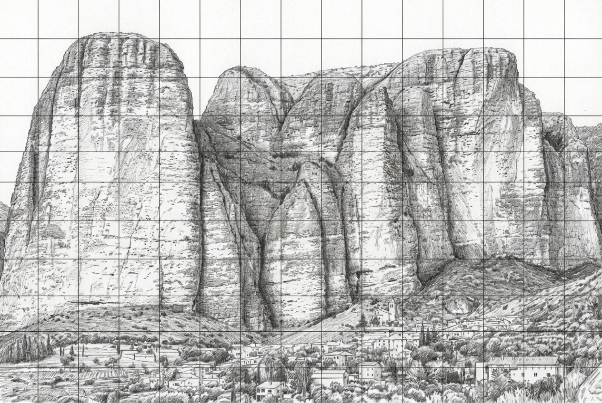

# Riglos

[Libro de Estilo]
[Replanteo]
[Metodología]

## Libro de Estilo [LeE]

Riglos es el proyecto común de censo de aves que engloba las siguientes carpetas/etiquetas:

### [Rgl]

1. Se recaba bibliografía de censos y metodologías para aplicarlas al censo.

3. Se plantea un cuadriculado de cada sector para anotar posiciones cada vez que se prospecte y reducir la varianza de muestreo para establecer el grado de aproximación a un tamaño de muestra confiable.

2. Se determinan puntos de observación y más fotos para convertirlas en sketched y fichas de censo

### [Rb]

### [Agr]
